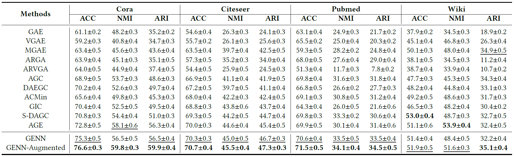
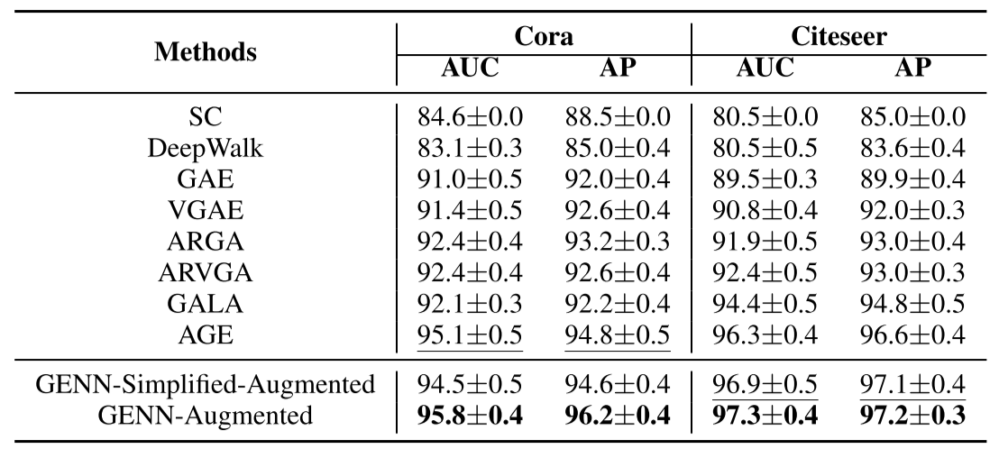

# GENN, Graph-Enforced Neural Network for Attributed Graph Clustering

This repository contains the official implementation of GENN. 


## Requirements

To install requirements:

```setup
pip install -r requirements.txt
```


## Training

To train GENN-Augmented:

```
python train.py --augmented
```

To train GENN:

```
python train.py
```


## Results

  Evaluation results on the clustering task:



Evaluation results on the link prediction task:

